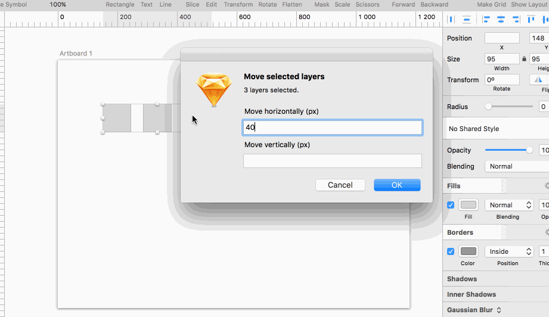

# Move It
Sketch plugin that let's you move selected layers vertically and horizontally.
Because there wasn't Illustrator Move feature out of the box.

## Instalation
1. Download plugin
2. Navigate the Sketch menu bar to `Plugins ▸ Reveal Plugins Folder...`
3. Place the `MoveIt` folder into the revealed plugins directory
4. That's it...

## Usage
1. Select layer(s) you want to move.
2. `Plugins ▸ Move It ▸ MoveIt` or <kbd>cmd</kbd> + <kbd>shift</kbd> + <kbd>m</kbd>
3. Enter how many px you want to move layer(s) horizontally and vertically.
4. Click OK.

##Contact
* Follow [@dawidwu](http://twitter.com/dawidwu) on Twitter
* Email <dawid@plaind.pl>
